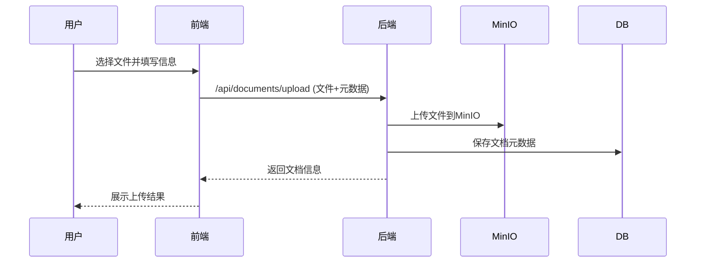
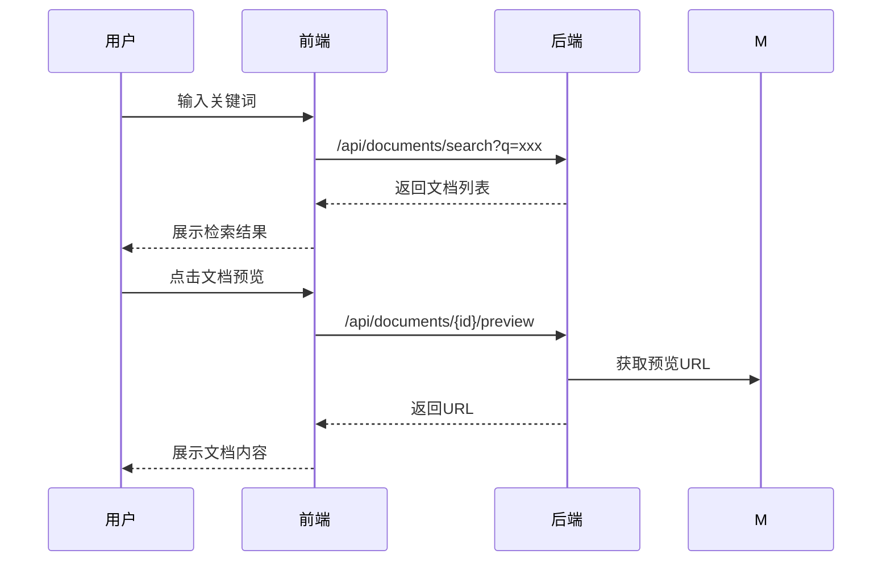
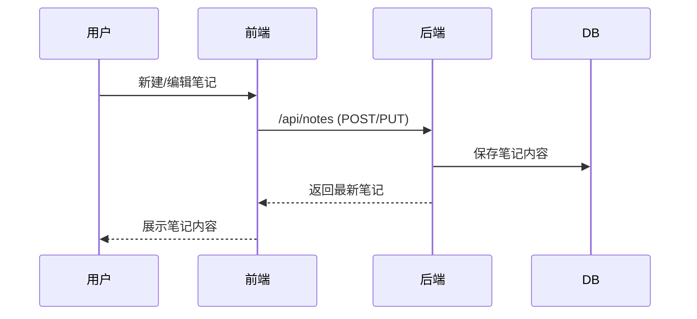
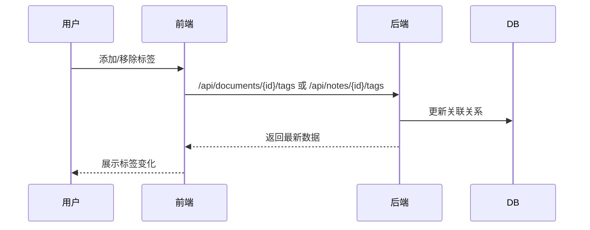
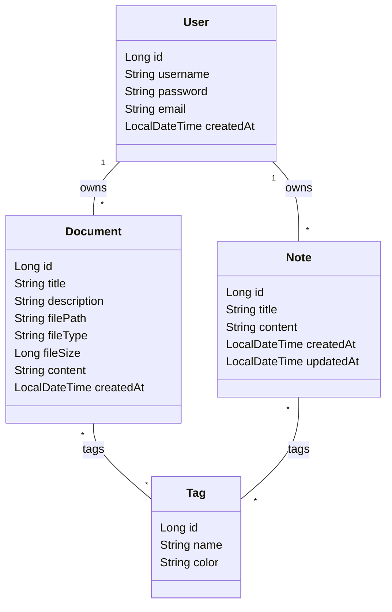

# 一体化知识管理平台 详细设计说明书

---

## 一、系统架构与技术选型

- **前端**：Vue 3 + Vite + Element Plus + Pinia 状态管理 + Axios  
- **后端**：Spring Boot 3.2.3 + Spring Security + JWT + Lombok  
- **数据库**：MySQL（结构化数据）、MinIO（文档文件存储）  
- **部署**：Docker Compose 一键启动  
- **日志与安全**：SLF4J+Logback 日志，BCrypt 密码加密，JWT 认证

---

## 二、后端详细设计

### 1. 目录结构

```text
backend/src/main/java/com/knowledge/
├── controller/   // 控制器，REST API
├── service/      // 业务逻辑
├── entity/       // 实体类，数据库映射
├── repository/   // 数据访问
├── dto/          // 数据传输对象
├── config/       // 配置类
├── util/         // 工具类
└── KnowledgeBaseApplication.java // 启动类
```

### 2. 主要数据模型

#### User（用户）
- id, username, password, email, createdAt

#### Document（文档）
- id, title, description, filePath, fileType, fileSize, content, user, tags, createdAt

#### Note（笔记）
- id, title, content, user, tags, createdAt, updatedAt

#### Tag（标签）
- id, name, color

### 3. 主要接口设计

#### 用户认证
- `POST /api/auth/register` 用户注册
- `POST /api/auth/login` 用户登录，返回JWT
- `POST /api/auth/logout` 用户登出
- `POST /api/auth/refresh` 刷新JWT

#### 文档管理
- `GET /api/documents` 获取当前用户所有文档
- `GET /api/documents/{id}` 获取文档详情
- `POST /api/documents/upload` 上传文档（支持多标签）
- `POST /api/documents/upload/multiple` 批量上传
- `PUT /api/documents/{id}` 更新文档信息
- `PUT /api/documents/{id}/content` 更新文档内容
- `DELETE /api/documents/{id}` 删除文档
- `GET /api/documents/{id}/download` 下载文档
- `GET /api/documents/{id}/preview` 获取文档预览URL（MinIO）
- `GET /api/documents/search?q=xxx` 文档全文检索
- `GET /api/documents/tag/{tagId}` 按标签筛选
- `POST /api/documents/{documentId}/tags` 添加标签
- `DELETE /api/documents/{documentId}/tags/{tagId}` 移除标签
- `GET /api/documents/stats` 获取文档统计
- `GET /api/documents/recent` 获取最近文档
- `POST /api/documents/create` 创建空文档

#### 笔记管理
- `GET /api/notes` 获取当前用户所有笔记
- `GET /api/notes/{id}` 获取笔记详情
- `POST /api/notes` 创建笔记
- `PUT /api/notes/{id}` 更新笔记
- `DELETE /api/notes/{id}` 删除笔记
- `GET /api/notes/search?q=xxx` 笔记全文检索
- `GET /api/notes/tag/{tagId}` 按标签筛选
- `POST /api/notes/{noteId}/tags` 添加标签
- `DELETE /api/notes/{noteId}/tags/{tagId}` 移除标签
- `GET /api/notes/stats` 获取笔记统计
- `GET /api/notes/recent` 获取最近笔记

#### 标签管理
- `GET /api/tags` 获取所有标签
- `POST /api/tags` 创建标签
- `PUT /api/tags/{id}` 更新标签
- `DELETE /api/tags/{id}` 删除标签

### 4. 文件存储与MinIO集成
- 文档上传后存储于MinIO，路径格式 `{userId}/{timestamp}_{filename}`
- 通过MinioService统一管理上传、下载、预览URL生成

---

## 三、前端详细设计

### 1. 目录结构

```text
frontend/src/
├── components/   // 组件（文档、笔记、上传、通用等）
├── views/        // 页面（如HomePage.vue）
├── api/          // API 封装
├── stores/       // Pinia 状态管理
├── utils/        // 工具函数
├── layouts/      // 布局组件
├── assets/       // 静态资源
├── router/       // 路由
├── App.vue
└── main.js
```

### 2. 主页面（HomePage.vue）设计

- **顶部导航栏**：Logo、搜索栏、主题切换、设置、新建（文档/笔记/上传）
- **左侧边栏**：文档库、我的笔记、标签列表、用户信息
- **主编辑区**：多标签页（文档、笔记、欢迎页），支持Markdown编辑、文档预览、文档编辑
- **状态栏**：标签页数量、当前时间
- **文件上传模态框**：支持拖拽上传、进度显示

### 3. 主要交互与功能

- **文档管理**：浏览、上传、下载、删除、标签管理、全文检索
- **笔记管理**：创建、编辑、删除、标签、搜索
- **标签系统**：多标签、多色彩、快速筛选
- **主题切换**：深色/浅色，CSS变量实现
- **快捷键**：如Ctrl+K聚焦搜索、Ctrl+N新建文档等
- **响应式布局**：适配桌面与移动端
- **用户信息与认证**：登录、注册、登出、JWT持久化

---

## 四、数据库结构（JPA实体）

- users（用户表）：id, username, password, email, created_at
- documents（文档表）：id, title, description, file_path, file_type, file_size, content, user_id, created_at
- notes（笔记表）：id, title, content, user_id, created_at, updated_at
- tags（标签表）：id, name, color
- document_tags（文档-标签关联）
- note_tags（笔记-标签关联）

---

## 五、关键流程说明

### 1. 文档上传



### 2. 文档检索与预览



### 3. 笔记创建与编辑



### 4. 标签管理



---

## 六、类图（核心数据模型）



---

## 七、界面与用户体验

- **风格**：Obsidian/VSCode风格，扁平化设计，支持深浅主题
- **标签页**：多文档/笔记并行编辑，支持关闭、切换
- **弹窗与模态框**：用于上传、设置、帮助等
- **辅助功能**：alt文本、键盘可操作、F1帮助、错误toast提示

---

## 八、部署与运维

- **Docker Compose**：一键启动MySQL、MinIO、后端、前端
- **环境变量**：统一管理数据库、MinIO、API地址
- **日志**：后端按天滚动，前端错误捕获